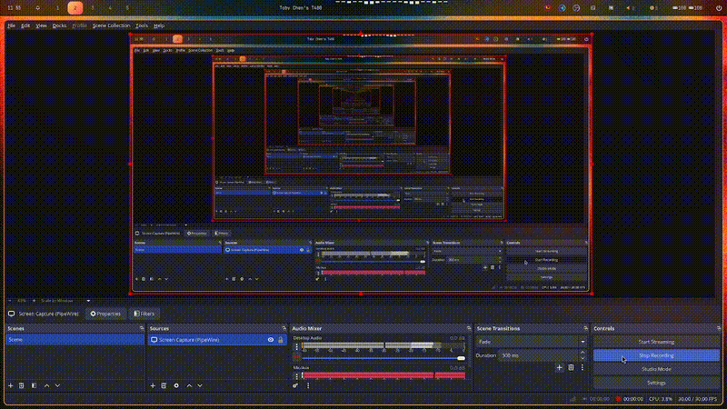

# FORT

## Short summary
Federated learning-based scoring on algorand. Compute off-chain (client device), sign and then append user scores on-chain.

## Full description
Organizations and people need a way to trust each other, but data sharing has become massive and given way to serious concerns about privacy. Users want control and auditors want verifiable trails.
Solution: FORT provides credit-like scoring with federated machine learning and on-chain attestations. Model training and inference run off-chain on client or edge data silos. Only a compact, signed result is written on-chain. The chain becomes a public log of who was scored and the result, without exposing underlying data from them.
Under the hood:
Federated model. A global model is trained across clients on their local devices without centralizing data. Aggregation yields model parameters and a model hash.
Local inference. A user’s device computes a score from local features. The raw data never leaves the device.
Attestation. A backend attestor (aggregator key) validates inputs, builds a domain-separated message.
Then, the frontend calls the FORT algorand app and the contract verifies the signature and writes an append-only record.
Finally, indexers read logs or app boxes to power the app and the scoring.

## Technical description
Technical description

Stack and SDKs:

* Frontend: React + TypeScript + Vite.
* Algorand: `algosdk` v3 for transactions and address decoding.
* Wallet: `@perawallet/connect` for wallet session and signing.
* Crypto: WebCrypto `SHA-256` in the browser and `tweetnacl` for optional Ed25519 demo signing.
* Build tooling: AlgoKit for project scaffolding and contract artifacts. ARC-56 JSON used to generate a typed TS client.
* Optional backend prototype: Python `fastapi`, `numpy`, `pandas`, `PyNaCl`, `py-algorand-sdk` for address utils. Not required for demo.

Data and model:

* CSV format: `date,amount`. 90-day daily series aggregated in browser.
* Features: inflow mean and std, outflow mean and std, net flow, vol ratio, max drawdown, periodicity score, shock recovery, skew, kurtosis. Money-scale terms are log-scaled.
* Model: logistic regression weights shipped as JSON. Probability of default `PD = σ(w·x + b)`. Credit score `CRI = 1 − PD`. Contract scale `score_u16 = round(CRI * 1000)`.

Browser scoring flow:

1. Vite bundles `src/assets/model/global_model.json` and `src/assets/data/client_*.csv`.
2. App loads the latest CSV, computes features, then CRI in the browser.
3. Computes `modelHashHex = sha256(canonical(weights))`. Computes `artifactHashHex = sha256(csv_bytes)`.
4. Demo signing is optional. If a throwaway 32-byte seed is present, `tweetnacl.sign.detached` signs the message layout.

On-chain write path (disabled in simulate mode):

* Build an application call with args:
  `method="append_score_v1" | user_pk | u64(score) | model_hash | artifact_hash | u64(ts) | sig`.
* Suggested params from Algod.
* Box name `boxKey = sha256(user_pk || u64(ts))`.
* Pera signs the transaction. Algod broadcasts. TxID returned.

Contract design:

* PyTeal style app compiled by AlgoKit. Artifacts emitted as ARC-56 JSON plus TEAL binaries.
* The app verifies `ed25519verify(prefix || user_pk || score || model_hash || artifact_hash || ts, sig, attestor_pk)`.
* Writes a record to a box keyed by `boxKey`. Optional log for indexers.
* Policy: append-only per user and time. Rejects malformed sizes and unknown attestor keys.

Algorand features that make this possible:

* Ed25519 everywhere: the chain uses Ed25519. On-chain `ed25519verify` matches off-chain signatures bit-for-bit. No custom curves.
* Boxes: scalable per-user storage with byte-keyed entries. Lets you time-slice histories with `sha256(user || ts)` and keep costs predictable.
* ABI and typed clients: ARC-4 ABI and ARC-56 contract interface JSON enable safe, typed TS client generation and simple app calls.
* Fast finality and low fees: appending small proofs is cheap and confirmed in seconds, so scores become an auditable stream.
* Deterministic logs and indexer: emitted logs can be indexed to fetch the latest score fast without scanning boxes manually.

Privacy and integrity:

* No raw user data on-chain. Only score, hashes, timestamp, and signature.
* Anyone can recompute CRI from the CSV and weights and match against the on-chain record via hashes.
* Domain prefix in the signed message prevents cross-protocol replay.

Deployment modes:

* Simulate mode `APP_ID=0`: compute and print in browser. No wallet. No network.
* On-chain mode `APP_ID>0`: same compute, plus Pera signing and one app call to record the signed result.

Hand-off for teammates:

* Replace demo signing with a real attestor. Provide attestor pubkey to the contract.
* If using a backend, expose a `/sign-score-latest` that returns `{score, modelHashHex, artifactHashHex, ts, sigB64}`. The frontend already accepts that shape.

This starter full stack project has been generated using AlgoKit. See below for default getting started instructions.

## Setup

### Initial setup
1. Clone this repository to your local machine.
2. Ensure [Docker](https://www.docker.com/) is installed and operational. Then, install `AlgoKit` following this [guide](https://github.com/algorandfoundation/algokit-cli#install).
3. Run `algokit project bootstrap all` in the project directory. This command sets up your environment by installing necessary dependencies, setting up a Python virtual environment, and preparing your `.env` file.
4. In the case of a smart contract project, execute `algokit generate env-file -a target_network localnet` from the `FORT-contracts` directory to create a `.env.localnet` file with default configuration for `localnet`.
5. To build your project, execute `algokit project run build`. This compiles your project and prepares it for running.
6. For project-specific instructions, refer to the READMEs of the child projects:
   - Smart Contracts: [FORT-contracts](projects/FORT-contracts/README.md)
   - Frontend Application: [FORT-frontend](projects/FORT-frontend/README.md)

> This project is structured as a monorepo, refer to the [documentation](https://github.com/algorandfoundation/algokit-cli/blob/main/docs/features/project/run.md) to learn more about custom command orchestration via `algokit project run`.

### Subsequently

1. If you update to the latest source code and there are new dependencies, you will need to run `algokit project bootstrap all` again.
2. Follow step 3 above.

## Tools

This project makes use of Python and React to build Algorand smart contracts and to provide a base project configuration to develop frontends for your Algorand dApps and interactions with smart contracts. The following tools are in use:

- Algorand, AlgoKit, and AlgoKit Utils
- Python dependencies including Poetry, Black, Ruff or Flake8, mypy, pytest, and pip-audit
- React and related dependencies including AlgoKit Utils, Tailwind CSS, daisyUI, use-wallet, npm, jest, playwright, Prettier, ESLint, and Github Actions workflows for build validation

### VS Code

It has also been configured to have a productive dev experience out of the box in [VS Code](https://code.visualstudio.com/), see the [backend .vscode](./backend/.vscode) and [frontend .vscode](./frontend/.vscode) folders for more details.

## Integrating with smart contracts and application clients

Refer to the [FORT-contracts](projects/FORT-contracts/README.md) folder for overview of working with smart contracts, [projects/FORT-frontend](projects/FORT-frontend/README.md) for overview of the React project and the [projects/FORT-frontend/contracts](projects/FORT-frontend/src/contracts/README.md) folder for README on adding new smart contracts from backend as application clients on your frontend. The templates provided in these folders will help you get started.
When you compile and generate smart contract artifacts, your frontend component will automatically generate typescript application clients from smart contract artifacts and move them to `frontend/src/contracts` folder, see [`generate:app-clients` in package.json](projects/FORT-frontend/package.json). Afterwards, you are free to import and use them in your frontend application.

The frontend starter also provides an example of interactions with your ScoreClient in [`AppCalls.tsx`](projects/FORT-frontend/src/components/AppCalls.tsx) component by default.

## Next Steps

You can take this project and customize it to build your own decentralized applications on Algorand. Make sure to understand how to use AlgoKit and how to write smart contracts for Algorand before you start.

# Canva Slide
https://www.canva.com/design/DAG2Otx34MU/_5wJ5cq1RReLeMzJ2cFRhA/view?utm_content=DAG2Otx34MU&utm_campaign=designshare&utm_medium=link2&utm_source=uniquelinks&utlId=hfb1947ce53